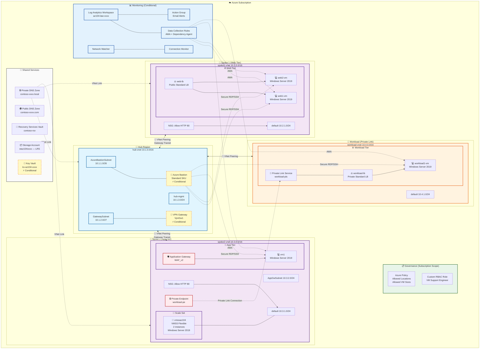

# AZ-104 Demo Environment Architecture

## Network Topology Diagram

## Resource Summary

| Category | Resource | SKU/Tier | Location | Conditional |
|----------|----------|----------|----------|-------------|
| **Networking** | hub-vnet | - | Hub | No |
| | spoke1-vnet | - | Spoke1 | No |
| | spoke2-vnet | - | Spoke2 | No |
| | workload-vnet | - | Workload | No |
| | NSG (spoke1) | Allow HTTP | Spoke1 | No |
| | NSG (spoke2) | Allow HTTP | Spoke2 | No |
| **Gateways** | VPN Gateway | VpnGw1 | Hub | Yes (`deployVpnGateway`) |
| | Azure Bastion | Standard | Hub | Yes (`deployBastion`) |
| **Load Balancing** | web-lb | Public Standard | Spoke1 | No |
| | workload-lb | Private Standard | Workload | No |
| | Application Gateway | WAF_v2 | Spoke2 | No |
| **Compute** | web1-vm, web2-vm | B2s_v2 (default) | Spoke1 | No |
| | vm1 | B2s_v2 (default) | Spoke2 | No |
| | workload1-vm | B2s_v2 (default) | Workload | No |
| | vmssaz104 | B2s_v2 / 2 instances | Spoke2 | No |
| **Private Link** | workload-pls | - | Workload | No |
| | workload-pe | - | Spoke2 | No |
| **Shared** | Public DNS Zone | contoso-xxxx.com | Global | No |
| | Private DNS Zone | contoso-xxxx.local | Global | No |
| | Recovery Services Vault | RS0 Standard | Hub | No |
| | Storage Account | Standard LRS | Hub | No |
| | Key Vault | Standard | Hub | Yes (`deployKeyVault`) |
| **Governance** | Azure Policy | Allowed Locations | Subscription | No |
| | Azure Policy | Allowed VM Sizes | Subscription | No |
| | Custom Role | VM Support Engineer | Subscription | No |
| **Monitoring** | Log Analytics Workspace | - | Hub | Yes (`deployMonitoring`) |
| | Network Watcher | - | All regions | Yes |
| | DCR + AMA | VM Insights | All tiers | Yes |
| | Connection Monitor | - | Hub | Yes |
| | Action Group / Alerts | Email | Hub | Yes |

## Deployment Toggles

| Parameter | Default | Description |
|-----------|---------|-------------|
| `deployBastion` | `true` | Deploy Azure Bastion in hub |
| `deployVpnGateway` | `true` | Deploy VPN Gateway + Gateway Transit |
| `deployKeyVault` | `true` | Deploy Key Vault for CMK demos |
| `enableCmkForStorage` | `false` | Enable Customer-Managed Keys on Storage |
| `deployMonitoring` | `true` | Deploy full monitoring stack |

## VM Size Overrides

| Parameter | Default | Applies To |
|-----------|---------|------------|
| `defaultVmSize` | `Standard_B2s_v2` | All tiers (fallback) |
| `webTierVmSize` | `''` (uses default) | web1-vm, web2-vm |
| `appTierVmSize` | `''` (uses default) | vm1 |
| `workloadTierVmSize` | `''` (uses default) | workload1-vm |
| `vmssVmSize` | `''` (uses default) | vmssaz104 |
