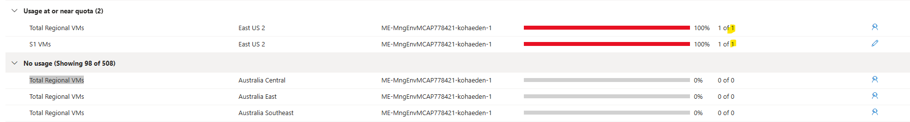

# AZ-104 Azure Administrator Demo Environment

This repository contains infrastructure as code (Bicep) to deploy a comprehensive environment for Azure Administrator (AZ-104) training and demonstrations.

## Pre-deployment Steps

1. **Verify VM SKU availability in your target regions**:
   This deployment uses `Standard_B2s_v2` VM SKUs by default. Check that this SKU is available in your chosen regions:
   ```bash
   az vm list-skus --resource-type virtualMachines --query "[?name=='Standard_B2s_v2'].locations[]" -o tsv
   ```
   If the SKU is not available in your target regions, you can modify the VM sizes in `infra/main.parameters.json` or choose different regions.

2. **Check App Service quota in your target regions**:
   Verify that your subscription has sufficient App Service quota for the deployment. Check that both "Total Regional VMs" and "S1 VMs" quotas are not set to 0 in your target regions.
   
   

3. **Configure deployment parameters** (optional):
   Before deploying, you can customize the deployment by editing `infra/main.parameters.json`. See the "Configuration" section below for details.

4. **Verify subscription access**:
   - Ensure you have Owner or Contributor access to the subscription
   - For governance components, you need User Access Administrator to create custom roles

## Deployment Instructions

## 1. Installation 
- You need [Azure Developer CLI - AZD](https://learn.microsoft.com/en-us/azure/developer/azure-developer-cli/install-azd), in case that's your first azd deployment go ahead and install it.
    - When installing AZD, the following tools will be installed on your machine as well, if not already installed:
        - [GitHub CLI](https://cli.github.com)
        - [Bicep CLI](https://learn.microsoft.com/en-us/azure/azure-resource-manager/bicep/install)

## 2. Deploying the scenario in 3 steps: 

1. Create a new folder on your machine and navigate to it.
```
mkdir -p sqltattoo/azd-az104-all-in-one && cd sqltattoo/azd-az104-all-in-one 
```
2. Next, run `azd init` to initialize the deployment.
```
azd init -t sqltattoo/azd-az104-all-in-one
```
3. Last, run `azd up` to trigger an actual deployment.
```
azd up
```

**Optional:** If you need to force a redeployment or explicitly pass the parameter file:
```bash
azd up --force  # Force redeployment even if no changes detected

# Or explicitly reference the parameter file:
azd deploy --parameters @infra/main.parameters.json
```
## Demo Features
Check the **[demo guide](https://raw.githubusercontent.com/sqltattoo/azd-az104-all-in-one/refs/heads/main/demoguide/demoguide.md)** for details on the demo scenario.

## Configuration

**Updated: November 17, 2025**

### Parameter File Approach

All deployment configuration is managed through the Bicep parameters file `infra/main.parameters.json`. This provides predictable, consistent behavior across all deployments.

**Why we moved from `azure.yaml` to a parameter file:**
- The `infra.parameters` section in `azure.yaml` did not reliably control runtime deployments
- Changes to feature toggles (like `deployBastion`, `deployVpnGateway`) and VM sizes were not consistently applied
- A standard ARM/Bicep parameter file ensures Azure Resource Manager processes parameters correctly every time

### Customizing Your Deployment

Edit `infra/main.parameters.json` before running `azd up`. Key parameters you can customize:

**Locations:**
```json
"hubLocation": { "value": "uksouth" },
"spoke1Location": { "value": "westeurope" },
"spoke2Location": { "value": "northeurope" },
"workloadLocation": { "value": "uksouth" }
```

**Feature Toggles:**
```json
"deployBastion": { "value": false },      // Set to false to skip Bastion (saves cost/quota)
"deployVpnGateway": { "value": false },   // Set to false to skip VPN Gateway
"deployKeyVault": { "value": true }       // Enable/disable Key Vault demos
```

**VM Size Configuration:**

Control VM sizes for cost optimization or quota constraints:

```json
"defaultVmSize": { "value": "Standard_B2s_v2" },        // Default for all tiers
"webTierVmSize": { "value": "" },                   // Empty = use default
"appTierVmSize": { "value": "Standard_B2s_v2" },      // Override for app tier only
"workloadTierVmSize": { "value": "" },              // Empty = use default
"vmssVmSize": { "value": "Standard_B2s_v2" }           // VMSS instance size
```

**Example: Low-quota environment**
```json
"defaultVmSize": { "value": "Standard_B1s" },
"deployBastion": { "value": false },
"deployVpnGateway": { "value": false }
```

**Naming and DNS:**
```json
"publicDnsZoneBase": { "value": "contoso.com" },
"privateDnsZoneBase": { "value": "contoso.local" },
"vaultName": { "value": "contoso-rsv" },
"storageAccountPrefix": { "value": "staz104" },
"adminObjectId": { "value": "" }  // Optional: your Azure AD Object ID for Key Vault access
```

After editing the parameter file, run:
```bash
azd up
```

**Note:** `adminUsername` and `adminPassword` are handled interactively by `azd` during deployment and should not be added to the parameter file.

## Cleanup for Previous Deployments

**Important Note (Updated: October 17, 2025)**

If you deployed this solution **before October 17, 2025**, you may encounter deployment errors when redeploying to a different Azure region. This is due to a static subscription-scoped governance deployment that was location-bound.

### Symptoms
You'll see an error like:
```
InvalidDeploymentLocation: The deployment 'governance-components' already exists in location 'uksouth'.
```

### Solution
Before running `azd up` in a new region, delete the old subscription-scoped deployment:

```bash
# Delete the static governance deployment (one-time cleanup)
az deployment sub delete --name governance-components

# Optional: List and clean up custom roles if starting fresh
az role definition list --custom-role-only true --query "[?contains(roleName, 'AZ104')]"

# Optional: List policy assignments for review
az policy assignment list --query "[?contains(displayName, 'AZ104')]"
```

After cleanup, proceed with normal deployment:
```bash
azd up
```

**What changed:** The governance deployment now uses a dynamic name based on your hub location (e.g., `governance-westeurope`), allowing multi-region deployments without conflicts.

## Troubleshooting

- Key Vault deployment fails: Verify your Object ID is correct and that you have sufficient permissions
- Custom RBAC role not visible: It may take a few minutes for the role to appear in the Azure Portal
- Monitoring agent failures: Ensure VMs are fully provisioned before deploying monitoring
- Location conflicts: See the "Cleanup for Previous Deployments" section above
